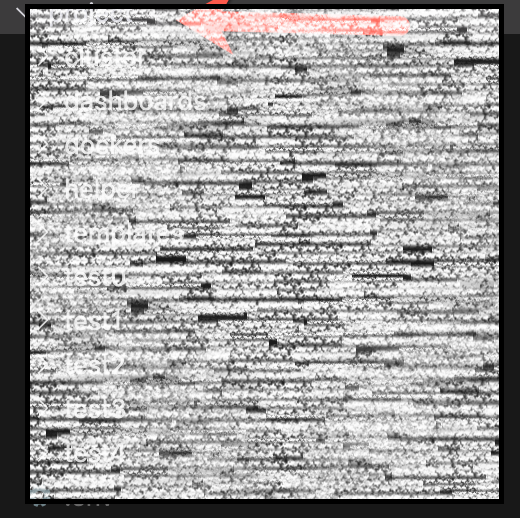
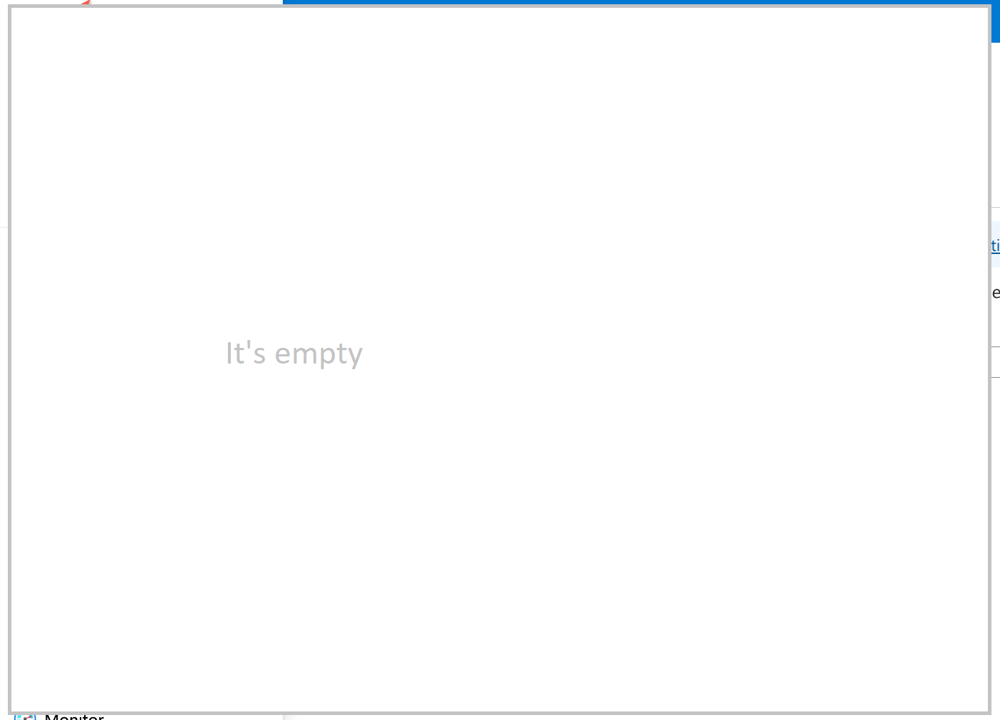

# Introduction

## Scope

### Audience

This series of articles is tailored for professionals who are already familiar with Kubernetes and have experience deploying applications within a Kubernetes environment. If you have successfully utilized Kubernetes to manage and deploy applications and are looking to expand your expertise by integrating FNU's ThingWorx platform, this series is for you.

### What You Will Learn

Throughout these articles, you will learn how to deploy ThingWorx on Kubernetes using Helm charts, specifically within the Azure cloud environment. The series will guide you through:

- Setting up and managing Helm chart repositories.
- Preparing your Azure environment, including resource groups, virtual networks, and container registries.
- Creating and managing content repositories for Docker images.
- Deploying and configuring Azure Kubernetes Service (AKS) clusters.
- Implementing essential supporting components such as Monitoring Stacks, Certificate Managers, Ingress Controllers, Azure PostgreSQL Databases, and Storage Accounts to facilitate ThingWorx deployment.
- Detailed steps to deploy ThingWorx in various configurations, including standalone, high availability (HA), and with enhanced management components (eMC).
- Procedures for upgrading ThingWorx deployments.

### Focus of the Series

The primary focus of this series is the deployment of ThingWorx on Kubernetes. To support this deployment, we will introduce and configure several ancillary components:

- **Monitoring Stack:** Ensures the health and performance of your ThingWorx deployment.
- **Certificate Manager:** Manages SSL/TLS certificates for secure communications.
- **Ingress Controller:** Manages external access to the services deployed in your Kubernetes cluster.
- **Azure PostgreSQL Database:** Provides a robust and scalable database solution for ThingWorx.
- **Storage Account:** Facilitates persistent storage needs for your applications.

Please note that while these components are essential for deploying ThingWorx, **the series will cover their configuration only to the extent necessary for ThingWorx deployment**. We will not delve deeply into their underlying principles or comprehensive configurations. In a production environment, these components should be configured and managed according to your organization's specific requirements and security practices. Enterprises may need to adjust configurations such as Azure Cluster settings, PostgreSQL Database parameters, and Storage Account options based on their unique infrastructure and operational needs.

## Deployment Diagram

(The number of **pod**  is for illustration only)


In the above diagram, the number of pods is for illustration purposes only. Except for the ZooKeeper nodes, which need to be in odd numbers (1, 3, 5, etc.), all other nodes can be one or more. We will discuss this further in a later chapter.

Assuming you have sufficient permissions within an Azure Subscription, we will guide you step-by-step from creating an Azure resource group. The "MC resource group," an AKS-managed resource group, will be created automatically when you create an AKS cluster.

## Tools Used

Throughout this series, you will utilize several tools to manage and deploy your Kubernetes resources effectively,**Caution**: the version of the tools used in this series is not the latest version. Please check the latest version of the tools and update the version if necessary. You must ensure the `helm` and `helmsman` are the same version and later than v3.8.0.

- **Azure CLI:** A command-line tool for managing Azure resources.
  - **Description:** Facilitates the creation, management, and configuration of Azure services from the command line.
  - **Installation:** [Install Azure CLI](https://docs.microsoft.com/en-us/cli/azure/install-azure-cli)
  - **Version used in this series:** v2.65.0

- **Helm:** A package manager for Kubernetes, enabling the management of Kubernetes applications.
  - **Description:** Simplifies the deployment and management of applications through Helm charts.
  - **Installation:** [Install Helm](https://helm.sh/docs/intro/install/)
  - **Version used in this series:** v3.17.1

- **kubectl:** The Kubernetes command-line tool.
  - **Description:** Allows you to run commands against Kubernetes clusters to deploy applications, inspect and manage cluster resources, and view logs.
  - **Installation:** [Install kubectl](https://kubernetes.io/docs/tasks/tools/install-kubectl/)
  - **Version used in this series:** v1.32.1

- **Helmsman:** A Helm charts as code tool, used for managing Kubernetes clusters declaratively.
  - **Description:** Enables the automation and management of Helm charts deployments using declarative configuration files.
  - **Installation:** [Install Helmsman](https://github.com/Praqma/helmsman#installation)
  - **Version used in this series:** v3.17.1

- **Helm Diff:** A Helm plugin that shows a diff between the current state and the desired state of a Helm release.
  - **Description:** Useful for previewing changes before applying them to ensure that updates are as expected.
  - **Installation:** [Install Helm Diff](https://github.com/databus23/helm-diff#installation)
  - **Version used in this series:** Installed via Helm

- **k9s:** A terminal-based UI to interact with your Kubernetes clusters.
  - **Description:** Provides an intuitive interface for managing and monitoring Kubernetes resources in real-time.
  - **Installation:** [Install k9s](https://k9scli.io/topics/install/)
  - **Version used in this series:** v0.27.1

- **envsubst:** A command-line tool for substituting environment variables in text files (Linux/Mac only).
  - **Description:** Used to replace environment variables in YAML templates and other configuration files. Windows users should use PowerShell's built-in environment variable expansion instead.
  - **Installation:** 
    - On Ubuntu/Debian: `sudo apt-get install gettext-base`
    - On Mac: `brew install gettext`
  - **On Windows**: Windows doesn't have a similar tool but we have provided a powershell script `Replace-EngVars.ps1` in the `helper` folder to serve the same purpose
  
  

## Prerequisites

Before diving into the series, ensure that you have the following:

- **Azure Subscription and Account:** You must have an active Azure subscription and an Azure account with sufficient permissions to create and manage resources. If you lack the necessary permissions, you may need assistance from your organization's Azure administrator to set up certain components.
- **Kubernetes Knowledge:** A solid understanding of Kubernetes concepts and experience with deploying applications on Kubernetes clusters.
- **Basic Networking Knowledge:** Familiarity with networking concepts, especially within the Azure environment, to effectively manage virtual networks and subnets.

### Additional Considerations

Creating components such as Azure Clusters, PostgreSQL Databases, and Storage Accounts will be covered to meet the basic requirements for deploying ThingWorx. These guides provide the foundational steps necessary for ThingWorx deployment; however, enterprises should tailor these configurations to align with their specific infrastructure, security policies, and operational practices. For example, organizations may implement additional firewalls, utilize different internal communication encryption methods, and adopt other security measures to comply with their internal standards and regulatory requirements.

In this series, Azure resources will be created using three primary methods:

1. **Azure Portal:** A web-based user interface for managing Azure resources.
2. **Azure CLI on Linux/Mac Shell:** Command-line interface for automating resource management on Linux and Mac systems.
3. **Azure CLI on Windows PowerShell:** Command-line interface for automating resource management on Windows systems.

These methods are provided to accommodate different user preferences and environments. However, deploying ThingWorx is not limited to these approaches. In real-world enterprise scenarios, infrastructure as code tools like Terraform may be employed to manage Azure resources. The use of such tools is independent of ThingWorx deployment and remains transparent to the process. Organizations should choose the method that best fits their existing workflows and infrastructure management practices.


## Work Folder and Common OS Environment Variables



Please download the attached small zip file and unzip it to a **working folder** you created. Under the working folder, you should see several components:

- **helper** subfolder

- **templates** subfolder

- **dashboards** subfolder

- **cluster** subfolder (this folder may be empty at the beginning)

- **dockers** subfolder

- **test0, test1, test2, test3, test4** subfolders

  

The **First step** of the preparation is to create a `.env` file in the current **working folder**

```Shell
cp templates/.env.template ./.env
```

The new **.env** file would look like:

```shell

# Azure Configuration
SUBSCRIPTION_NAME="AZURE-FNU-SD-IOT-PRESALES-AD"
TENANT_ID="bc674695-33a0-xxxxx"

# recommand you search for `fnudemo` and replace it with your own name
# Resource Group and Location
RESOURCE_GROUP="fnudemo-rg"
LOCATION="eastus"

# Virtual Network Configuration
VNET_NAME="fnudemo-vnet"
VNET_ADDRESS_PREFIX="177.199.0.0/16"
DEFAULT_SUBNET_NAME="fnudemo-default-subnet"
DEFAULT_SUBNET_PREFIX="177.199.96.0/20"
FLEXIBLE_DB_SUBNET_NAME="fnudemo-flexdb-subnet"
FLEXIBLE_DB_SUBNET_PREFIX="177.199.120.0/24"
NODE_SUBNET_NAME="fnudemo-nodes-subnet"
NODE_SUBNET_PREFIX="177.199.121.0/24"

# Azure Container Registry for both container images and helm charts
ACR_NAME="fnudemocr"

CLUSTER_NAME="fnudemo-aks"
#MC_GROUP_NAME="MC_${RESOURCE_GROUP}_${CLUSTER_NAME}_${LOCATION}"

# AKS Cluster Configuration
KUBERNETES_VERSION="1.30.7"
NODE_COUNT=1
NODE_VM_SIZE="Standard_D8s_v3"

# DNS Configuration, you don't need to change this two settings if you are using the same subscription as the one used in the book
DNS_ZONE_RESOURCE_GROUP="device-loadtest-rg"
DNS_ZONE_NAME="demo.fnu.abc.FNU.io"

# usually you don't need to change these three settings
CERTIFICATE_NAME=letsencrypt-certificate
SECRET_NAME=cert-manager-azuredns-secret
CLUSTER_ISSUER_NAME=letsencrypt-cluster-issuer

# Public IP for the AKS Cluster
IP_NAME="fnudemo-publicip"

# Database Configuration
DB_SERVER_NAME="fnudemoflex"
DB_ADMIN_USER="postgres"
DB_ADMIN_PASSWORD="PleaseDONTChangeMe2025!"

# Storage Configuration
STORAGE_ACCOUNT_NAME="fnudemopremium"
STORAGE_CLASS_NAME="fnufilereponfs"
STORAGE_CLASS_NAME_SMB="fnufilereposmb"
```

**Caution**: I recommend you search for `fnudemo` and replace it with your favorited term, shorter is better.

**Caution**: Slightly change the two leading digits in the 4 address prefix. For example: you can change all `177.199` to `177.200` or `178.199` etc.


For the`TENANT_ID`, you can login to your subscription on Azure and then follow the below screenshot to get the both values.



To find out the `SUBSCRIPTION_NAME`, you can use the following command, make sure to replace `<your-tenanet-id>` with your real tenant ID value.

On Linux/Mac:

```Shell
az account list --query "[?tenantId=='<your-tenant-id>'].[name]" --output table
```

On Powershell:

```Powershell
Get-AzSubscription | Where-Object { $_.TenantId -eq "<your-tenant-id>" } | Select-Object Name
```


The output looks like above, you can choose the first one or consult your administrator.


For all of other variables, please choose your value at your preference but you have to obey Azure's rule or limitation.

## Summary

By the end of this series, you will have a comprehensive understanding of deploying ThingWorx on Kubernetes within Azure, leveraging Helm charts for streamlined management, and configuring the necessary supporting infrastructure to ensure a robust and scalable deployment. This will empower you to effectively integrate ThingWorx into your Kubernetes-managed environments, utilizing Azure's cloud capabilities to their fullest potential.
