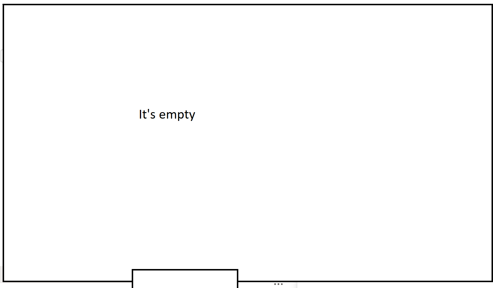

# Helm-Chart Repository


## Load OS variables every time when you open a new console

### Using Environment Variables in Kubernetes

During the entire serials, it is assumed that you are under the working directory in the console. Please ensure to load the OS variables from the **.env** file every time.

On Linux/Mac:

```shell
. ./helper/load-envfile.sh
```

On Windows Powershell:

```Powershell
helper\Load-EnvFile.ps1
```


## Introduction to Helm-Chart Repository

A Helm Chart Repository is a location where packaged Helm charts can be stored and shared. It serves as a centralized place for versioned Helm charts, allowing users to easily discover and install applications. The repository contains an index.yaml file that provides metadata about the available charts.

Official Helm documentation: [https://helm.sh/docs/topics/chart_repository/](https://helm.sh/docs/topics/chart_repository/)

## Common Repository Setup Methods
Here are some common ways to establish a Helm Chart Repository:

1. **GitHub Pages**
2. **Azure Container Registry (ACR)**
3. **Amazon S3**
4. **Google Cloud Storage**
5. **Harbor Registry**
6. **ChartMuseum**
7. **JFrog Artifactory**
8. **Nexus Repository**

You can also download the required helm-charts in local disk.

In this article, we will talk about two methods: using local folder and using the existing Azure Container Registry as a Helm Chart Repository


## Build your helm-charts library

### Add the source helm repo

You can add the following repository to your helm repo:

On Linux/Mac:

```shell
export GITHUB_TOKEN="github_pat_fnu"
helm repo add fnu-charts \
    --username fnu \
    --password $GITHUB_TOKEN \
    https://raw.githubusercontent.com/fnu/charts/main/
helm repo update
```

On Powershell:

```Powershell
# Set the environment variable GITHUB_TOKEN
$env:GITHUB_TOKEN = "github_pat_fnu"

# Add the Helm repository 'fnu'
helm repo add fnu-charts `
    --username fnu `
    --password $env:GITHUB_TOKEN `
    https://raw.githubusercontent.com/fnu/charts/main/
helm repo update
```


You can use `helm search fnu-charts` command to check the content. The following helm-charts will be downloaded.

The list of helm-charts built by fnu:

| Name                                 | Chart Version | App Version | Description                                        |
| ------------------------------------ | ------------- | ----------- | -------------------------------------------------- |
| fnu-charts/fnu-0  | 2.0.26        | 9.2.1       | A Helm chart for Kubernetes                        |
| fnu-charts/certificate-manager | 1.0.7         |             | A Helm chart for Generating Certificates           |
| fnu-charts/fnu-1   | 2.1.22        | 1.0         | A Helm chart for Kubernetes                        |
| fnu-charts/ignite              | 2.0.23        | 2.17.0      | Apache Ignite is an open-source distributed dat... |
| fnu-charts/provisioning        | 1.0.11        |             | Provision secrets and PVC                          |
| fnu-charts/security-common     | 1.0.5         |             | Common Security Tool to create a Keystore and e... |
| fnu-charts/fnu-gas       | 1.0.0         | 7.1.0       | A Helm chart for deploying fnu GAS on Kub... |
| fnu-charts/fnu-postgres  | 1.0.1         |             | A Helm chart for deploying the fnu postgr... |
| fnu-charts/fnu-server    | 1.0.118       |             | A Helm chart for deploying fnu on Kubernetes |

The list of the helm-charts from 3rd party but we will use them in our deployments

| Name                                          | Chart Version | App Version | Description                                        |
| --------------------------------------------- | ------------- | ----------- | -------------------------------------------------- |
| fnu-charts/graphite-exporter            | 1.2.3         | 1.0         | A Helm chart for Kubernetes                        |
| fnu-charts/influxdb                     | 5.4.16        | 2.6.1       | InfluxDB(TM) is an open source time-series data... |
| fnu-charts/influxdb-enterprise          | 0.1.22        | 1.10.0      | Run InfluxDB Enterprise on Kubernetes              |
| fnu-charts/ingress-nginx                | 4.7.1         | 1.8.1       | Ingress controller for Kubernetes using NGINX a... |
| fnu-charts/postgresql                   | 12.2.6        | 15.2.0      | PostgreSQL (Postgres) is an open source object-... |
| fnu-charts/postgresql-ha                | 7.11.1        | 11.13.0     | Chart for PostgreSQL with HA architecture (usin... |
| fnu-charts/prometheus-postgres-exporter | 2.0.0         | 0.8.0       | A Helm chart for prometheus postgres-exporter      |

You can find the above tables in file templates/fnu-charts-list.txt

## Using local folder to manage helm-charts

Assuming you are in the `project` folder, let's download all required charts to local folder.

On Linux/Mac:

```Shell
mkdir -p standalone-deployment/fnu-charts
helper/download-localcharts.sh standalone-deployment/fnu-charts
```

On Powershell:

```Powershell
New-Item -ItemType Directory -Path "standalone-deployment/fnu-charts" -Force
helper\Download-Localcharts.ps1
```

You should see the exported folder:


In the future, if you want to manually pull out individual chart to local, you can use the following  command:

```shell
helm pull "$chart" --version "$version" --untar --untardir "$TARGET_DIR"
```

For example:

```shell
helm pull "fnu-charts/fnu-server" --version "1.0.118" --untar --untardir "standalone-deployment/fnu-charts"
```


## Using Azure Container Registry as Helm Chart Repository

This article will demonstrate using the existing Azure Container Registry as a Helm Chart Repository.

**Prerequisites:**
- Helm 3.x or later
- Azure CLI installed
- ACR must support OCI artifacts
- Proper authentication configured

**Azure CLI Commands:**

On Linux/Mac:

```shell
helper/download-ocicharts.sh $ACR_NAME
```

On Powershell:

```Powershell
helper\Download-Ocicharts.ps1 $env:ACR_NAME
```

You can login to the Azure portal and check the repositories under your $ACR_NAME, it looks like:


